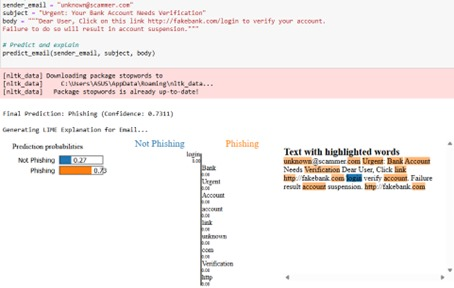

#  Phishing Email Detection using Classical ML and Deep Learning

A machine learning pipeline designed to detect phishing emails using advanced feature extraction techniques and explainable AI. This project explores different embedding strategies, model comparisons, and email-specific features like URLs for effective classification.

---

## Dataset Overview

The final dataset combines multiple phishing and legitimate email sources:

- **Enron**, **Ling**: Focus on email content (subject, body, labels)
- **CEAS**, **Nazario**, **Nigerian Fraud**, **SpamAssassin**: Include sender/recipient info, timestamps, etc.

**Final Dataset Summary:**
- Total Emails: **82,486**
- Spam Emails: **42,891**
- Legitimate Emails: **39,595**

---

## Problem Statement

The goal is to **automatically classify phishing emails** using both classical and deep learning techniques, leveraging natural language processing and domain-specific signals like URLs embedded in the email body.

---

## Methodology

### 1. Preprocessing
- Removed missing values
- Extracted and cleaned relevant columns: `Subject`, `Body`, `Sender`, `URLs`

### 2. Feature Engineering
- **SBERT embeddings** for text columns: `Subject`, `Body`, `Sender`
- **Word2Vec embeddings** for extracted URLs using regex
- Combined into a **single feature vector**: `combined_embedding`

### 3. Modeling
Tested on multiple ML models:
-  **Logistic Regression**
-  **Support Vector Machines (Linear / RBF / Poly)**
-  **Random Forest**
-  **XGBoost**

> Classical models were trained on `SpamAssassin` (5,809 rows) and then scaled to the merged dataset (82,486 rows) for final evaluation.

### 4. Deep Learning
-  **LSTM (24 epochs)**: Performed better than classical models on longer sequences.

### 5. Explainability
-  **LIME** (Local Interpretable Model-Agnostic Explanations) used to provide transparency to model predictions.

---

##  Results

| Model           | Notes                        |
|----------------|------------------------------|
| Logistic Reg.   | Strong baseline              |
| SVM (Linear)    | Good balance of precision & recall |
| Random Forest   | Handles overfitting better   |
| XGBoost         | Best performance overall     |
| LSTM            | Handles long-term dependency in text |

---

## Libraries used include:
- **scikit-learn**
- **xgboost**
- **sentence-transformers**
- **gensim**
- **nltk**
- **lime**
- **matplotlib, pandas, numpy**

## Author
### SriCheran CH
- **sricheran320@gmail.com**
